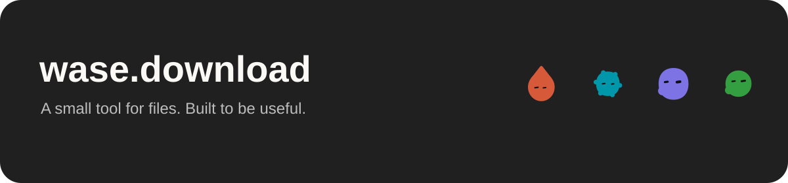

<p align="center"></p>

<p align="center"><a href="https://wase.download">Open converter</a> · <a href="https://wase.download/en/formats/">Supported formats</a> · <a href="https://wase.download/en/developers/">Developers</a> · <a href="https://wase.download/en/privacy/">Privacy</a></p>

A self-hosted file converter in English, Russian and Simplified Chinese. Drop a file, paste a screenshot, choose an output and download the result. No account and no third-party conversion API.

- **Ten families:** images, documents, ebooks, audio, archives, video, presentations, fonts, vectors and CAD/3D.
- **One workspace:** visible file queue, individual downloads, ZIP, retry and cancellation.
- **Two paths:** local browser image processing or resource-limited, offline server containers.
- **Accessible by default:** compact responsive UI, light/dark themes, keyboard menus and reduced-motion support.
- **Discoverable:** static localized pages, 21 tested conversion examples per language, full declared catalogue and a read-only MCP endpoint.

The pinned server build declares 915 input extensions. This is an engine catalogue, not a promise that every possible file or conversion pair works. Real byte-level smoke tests cover each family; detailed constraints are below.

## Run

Node.js 22.12+:

```sh
npm ci
npm run dev
```

Visit http://127.0.0.1:5188/ru/ (or `/en/`, `/zh/`).

```sh
npm run build
npm run preview
npx playwright install chromium webkit
npm test
# With the local converter API running:
RUN_SERVER_TESTS=1 npm test
```

`dist/` is a complete static site. Browser-only mode does not require an upload server. Server mode requires the local Node.js broker and Docker; see backend/README.md. Production compilation should happen in CI, not during a public page request or on every web-server restart.

## Limits

100 MB per file in server mode, 20 MB in browser fallback, 20 files per batch, 16 megapixels and an 8192-pixel input edge. SVG tracing downscales to at most 768/1024/1536 pixels for Simple/Balanced/Detailed, with 16/32/64 colors. Photographs are approximated, not losslessly vectorized. Browser GIF input uses the first frame. ICO has a maximum edge of 256 pixels. JPEG and BMP use a white background for transparency.

Browser mode supports the six output formats above. Server mode reads its catalogue from the pinned ConvertX image (915 input extensions in this build). These are declared engine capabilities, not a claim that every arbitrary input file or pair has been tested. Available targets depend on the input extension. SVG scripts, external resources, embedded raster images and unsupported constructs are rejected; ordinary paths, shapes, text and gradients are supported.

Clipboard formats and browser permissions vary. Paste keyboard shortcuts use the native paste event. The optional clipboard button shows a useful fallback when clipboard read is unavailable. Automated synthetic paste tests verify the event handling; physical iOS clipboard/device acceptance still needs a real-device check.

## Deployment and search

`deploy/nginx-site.conf` serves the site through a private local HTTP listener; an HTTPS frontend must provide the public host. `deploy/Caddyfile.website` is a standalone HTTPS website template. These are alternatives, not configurations to install together on the same public ports. `scripts/release.sh` installs a prebuilt release atomically; retain prior releases to roll back.

See `deploy/README.md` for certificates, caching, analytics and Search Console / Yandex Webmaster verification. Wordstat is keyword research, not a website registration tool.

## Architecture and resources

Static HTML → a small browser app → loopback Node broker → one isolated ConvertX container per job. Browser image tools use Web Workers. Public file URLs and persistent histories are not created; temporary inputs and outputs are deleted on completion, cancellation or error.

On the current one-core deployment, the API and converter containers share a **35% CPU budget**, with one active conversion. This deliberately favors server headroom over conversion speed. Deployment templates and the verified resource model are in [backend/README.md](backend/README.md).

## Built with open source

| Project | Role |
| --- | --- |
| [ImageTracer](https://github.com/jankovicsandras/imagetracerjs) | Original fork and local SVG tracing |
| [ConvertX](https://github.com/C4illin/ConvertX) | Self-hosted converter modules |
| [VTracer](https://github.com/visioncortex/vtracer) | Server vectorization into real SVG paths |
| [Blobatar](https://github.com/Alain00/blobatar) | Locally generated helper mascots |
| [fflate](https://github.com/101arrowz/fflate) | ZIP packaging |
| [jSquash](https://github.com/jamsinclair/jSquash) | Local WebP encoding on Safari |

LibreOffice, Pandoc, FFmpeg, resvg, FontTools and FontForge provide specialized conversions in the pinned server image. We retain upstream notices and do not claim these engines as original work.

This repository is an ImageTracer fork: its original Unlicense and [upstream README](UPSTREAM_README.md) are preserved. The server integration is AGPL-3.0; complete modified engine source is at [wase-converter-engine](https://github.com/vlad1337vlad1337-droid/wase-converter-engine). See [third-party notices](THIRD_PARTY_NOTICES.md).

## Design

Monochrome Wase Chat tokens, local Inter, Lucide controls and four small Blobatar helpers. Mascots never capture input; their animation stops when reduced motion is requested. No fabricated endorsements, usage numbers or project history.
