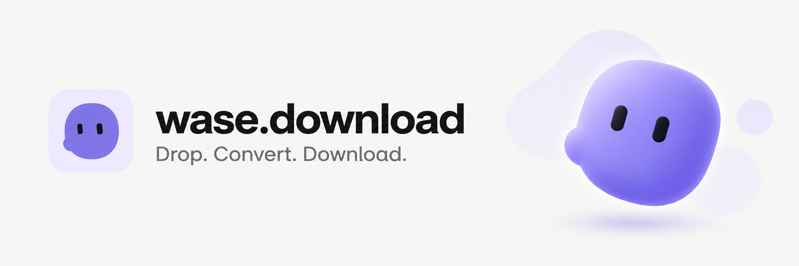

<p align="center"></p>

<p align="center"><a href="https://wase.download">Open converter</a> · <a href="https://wase.download/en/formats/">Supported formats</a> · <a href="https://wase.download/en/developers/">Developers</a> · <a href="https://wase.download/en/privacy/">Privacy</a> · <a href="#contribute">Contribute</a> · <a href="https://dalink.to/wase_download">Buy me a coffee</a></p>

A self-hosted file converter in 13 languages: English, Russian, Simplified Chinese, Spanish, French, German, Portuguese, Italian, Turkish, Japanese, Korean, Arabic and Hindi. Drop a file, paste a screenshot, choose an output and download the result. No account and no third-party conversion API.

- **Ten families:** images, documents, ebooks, audio, archives, video, presentations, fonts, vectors and CAD/3D.
- **One workspace:** visible file queue, result preview, individual downloads, ZIP, retry and cancellation.
- **Two paths:** local browser image processing or resource-limited, offline server containers.
- **Accessible by default:** compact responsive UI, light/dark themes, keyboard menus and reduced-motion support.
- **Discoverable:** static localized pages backed by real HTTP checks, an input-dependent declared catalogue and a read-only MCP endpoint.

The pinned engine build declares 915 input extensions; the upload policy exposes 885 actual file extensions after filtering devices and pseudo-formats. This is an engine catalogue, not a promise that every possible file or conversion pair works. Real byte-level smoke tests cover each family; detailed constraints are below.

## Support

[Buy me a coffee](https://dalink.to/wase_download) to support hosting and development. If the project is useful, a GitHub star helps other people discover it. Donations are optional; the converter remains free to use.

The footer shows a cached public GitHub star count. Starring opens GitHub and uses the visitor’s own account; we never embed a GitHub token or ask for repository access. “Save” shares the current page through the device menu, copies its canonical link, or shows the browser bookmark shortcut. Uploaded files are not included.

## Contribute

Try the converter, [report a bug or suggest an improvement](https://github.com/vlad1337vlad1337-droid/wase-download/issues), or send a pull request. The [contribution guide](CONTRIBUTING.md) covers setup, useful conversion-bug details and the checks to run before a change. Keep upstream and Wase Download license notices when reusing code; see [LICENSING.md](LICENSING.md).

## Run

Node.js 22.13+:

```sh
npm ci
npm run dev
```

Visit http://127.0.0.1:5188/ru/ (or `/en/`, `/zh/`).

```sh
npm run build
npm run preview
npx playwright install chromium webkit
npm test
# With the local converter API running:
RUN_SERVER_TESTS=1 npm test
```

`dist/` is a complete static site. Browser-only mode does not require an upload server. Server mode requires the local Node.js broker and Docker; see backend/README.md. Production compilation should happen in CI, not during a public page request or on every web-server restart.

## Limits

100 MB per file in server mode, 20 MB in browser fallback, and 20 files per batch. Browser fallback limits decoded images to 16 megapixels and an 8192-pixel edge; its Simple/Balanced/Detailed tracing uses at most 768/1024/1536 pixels and 16/32/64 colors. Server tracing preserves the original SVG canvas, normalizes orientation, and uses up to 1024 pixels for complex photographs with a bounded retry at 768. Small graphics retain native curves up to 1536 pixels. Photographs are approximated, not losslessly vectorized. The server keeps its CPU quota and permits longer wall time for tracing instead of increasing CPU use. Browser GIF input uses the first frame. ICO has a maximum edge of 256 pixels. JPEG and BMP use a white background for transparency.

Browser mode supports SVG, PNG, JPG, WebP, BMP and ICO. Server mode reads its catalogue from the pinned ConvertX image: 915 raw input identifiers, filtered to 885 public upload formats. These are declared engine capabilities, not a claim that every arbitrary input file or pair has been tested. Available targets depend on the input extension. Browser SVG input rejects scripts, external resources, embedded raster images and unsupported constructs; ordinary paths, shapes, text and gradients are supported.

Clipboard formats and browser permissions vary. Paste keyboard shortcuts use the native paste event. The optional clipboard button shows a useful fallback when clipboard read is unavailable. Automated synthetic paste tests verify the event handling; physical iOS clipboard/device acceptance still needs a real-device check.

## Deployment and search

`deploy/nginx-site.conf` serves the site through a private local HTTP listener; an HTTPS frontend must provide the public host. `deploy/Caddyfile.website` is a standalone HTTPS website template. These are alternatives, not configurations to install together on the same public ports. `scripts/release.sh` installs a prebuilt release atomically; retain prior releases to roll back.

See `deploy/README.md` for certificates, caching, analytics and Search Console / Yandex Webmaster verification. Wordstat is keyword research, not a website registration tool.

### Search and AI agents

Localized instructions and links are shipped as static HTML. The converter needs JavaScript, but reading the format guides does not. Public pages use canonical URLs, reciprocal language alternatives and honest application/site/publisher metadata. `robots.txt` allows public crawlers while excluding `/api/`; it does not authenticate clients or bypass upload/discovery limits. Training bot policies are separate from search visibility.

- [Agent navigation](https://wase.download/llms.txt) and [expanded guide](https://wase.download/llms-full.txt).
- [API and MCP guide](https://wase.download/api-guide.md): initialization, the two read-only tools, explicit uploads, limits, errors and privacy.
- [Published evidence manifest](https://wase.download/verified-conversions.json): representative-tested directions, distinguished from declared targets in `formats.json`.
- [Provider rules and visibility checks](deploy/seo/AI-SEARCH-GUIDE.md): official Google, Yandex, OpenAI, Anthropic, Perplexity, Microsoft and Apple sources.

The sitemap publishes 34,918 canonical pages across 13 languages for 2,681 representative-tested conversion directions plus the useful site pages. It deliberately excludes unverified input catalogues and errors. `llms.txt` is an optional documentation convention, not universal AI registration or a Google ranking signal. IndexNow notifies participating engines of changed canonical URLs after a release; receipt does not prove indexing. Search engines and AI systems choose which pages to index, show or cite.

## Architecture and resources

Static HTML → a small browser app → loopback Node broker → one isolated ConvertX container per job. Browser image tools use Web Workers. Public file URLs and persistent histories are not created; temporary inputs and outputs are deleted on completion, cancellation or error.

On the current one-core deployment, the API and converter containers share a **35% CPU budget**, with one active conversion. This deliberately favors server headroom over conversion speed. Deployment templates and the verified resource model are in [backend/README.md](backend/README.md).

## Built with open source

| Project | Role |
| --- | --- |
| [ImageTracer](https://github.com/jankovicsandras/imagetracerjs) | Original fork and local SVG tracing |
| [ConvertX](https://github.com/C4illin/ConvertX) | Self-hosted converter modules |
| [VTracer](https://github.com/visioncortex/vtracer) | Server vectorization into real SVG paths |
| [Blobatar](https://github.com/Alain00/blobatar) | Locally generated helper mascots |
| [fflate](https://github.com/101arrowz/fflate) | ZIP packaging |
| [PDF.js](https://github.com/mozilla/pdf.js) | Lazy, canvas-only PDF result preview |
| [jSquash](https://github.com/jamsinclair/jSquash) | Local WebP encoding on Safari |

LibreOffice, Pandoc, FFmpeg, resvg, FontTools and FontForge provide specialized conversions in the pinned server image. We retain upstream notices and do not claim these engines as original work.

Our original interface and tooling are MIT licensed: preserve the Wase Download copyright and permission notice when copying or forking. This repository started as an ImageTracer fork; its original Unlicense and [upstream README](UPSTREAM_README.md) remain preserved. See [licensing and attribution](LICENSING.md). The server integration is AGPL-3.0; complete modified engine source is at [wase-converter-engine](https://github.com/vlad1337vlad1337-droid/wase-converter-engine). See [third-party notices](THIRD_PARTY_NOTICES.md).

## Design

Monochrome Wase Chat tokens, local Inter, Lucide controls and four expressive Blobatar helpers around the workspace. Mascots never capture input; their animation stops when reduced motion is requested. No fabricated endorsements, usage numbers or project history.

## Conversion and indexing audit

The previous October 3 discovery run exercised 20,448 declared pairs using 156 representative input fixtures. Some parallel discovery attempts exhausted process limits; those attempts are not proof of conversion support. Archived byte validation and HTTP receipts plus the public file policy admit 2,681 published pairs, including the original popular converters. This does not mean all 915 catalogue entries or arbitrary input files work. See [the complete coverage report](deploy/seo/SITEMAP-COVERAGE.md), [per-input gaps](deploy/seo/input-verification.json), and [new-pair receipts](deploy/seo/verified-receipts.json).

Build output contains static pages in all 13 languages, with an Arabic RTL interface and a Sitemap index with language-specific child maps. Untested per-input directories remain accessible with `noindex,follow` and are excluded from Sitemap. Search-engine submission does not guarantee indexing or ranking.

## Useful conversions, not arbitrary combinations

The public policy excludes capture devices, ImageMagick generators/network transports and implicit still-photo-to-video synthesis. For example, 3FR → MP4 is not offered as an ordinary file conversion; GIF → MP4 and video → audio remain available. Mixed batches expose only targets shared by every input. These semantic checks are separate from decoder validation and do not promise that arbitrary files or every catalogue declaration work.

PNG Software metadata, JPEG comments, SVG comments and ZIP archive comments identify `Created by wase.download`. Other formats use the branded download filename without rewriting opaque binary structures or user document text. Image pixels, compression data and archive entry bytes remain untouched by this credit.

## Reuse

Forks should retain original Wase Download copyright notices, upstream credits and the applicable MIT / AGPL / Unlicense texts. See [LICENSING.md](LICENSING.md), [THIRD_PARTY_NOTICES.md](THIRD_PARTY_NOTICES.md) and [CONTRIBUTING.md](CONTRIBUTING.md). The conversion credit identifies the tool and does not claim ownership of uploaded files.

## Result preview

Completed results replace the primary convert action with Download or Download ZIP. Images, audio and video use native browser viewers; bounded text previews render as plain text, including HTML and code. PDF previews lazily load PDF.js and render only the first page to a canvas with scripting and annotations disabled. Documents, fonts, CAD and archive types without a browser viewer remain downloadable and show an explicit preview-unavailable message. Browser codec support still varies. Preview never executes uploaded HTML or opens it in an iframe.

The empty workspace fits ordinary mobile and desktop viewports. Long file queues scroll inside the workspace; opening conversion instructions, using a very short viewport, or increasing text size keeps normal page scrolling for accessibility.

The current 13-language Sitemap contains 34,918 canonical URLs. The 885 upload identifiers and 143,995 declared directions are not all fixture-verified: the representative corpus covers 156 raw identifiers, and archived 2,845 HTTP receipts produce 2,673 eligible directions plus eight baseline pages. The focused JPEG/SVG regression, including a full-resolution noisy photo, is documented in [conversion-regression-2026-10-03.json](deploy/conversion-regression-2026-10-03.json). Those historical HTTP conversions were not all rerun in this UI update.
